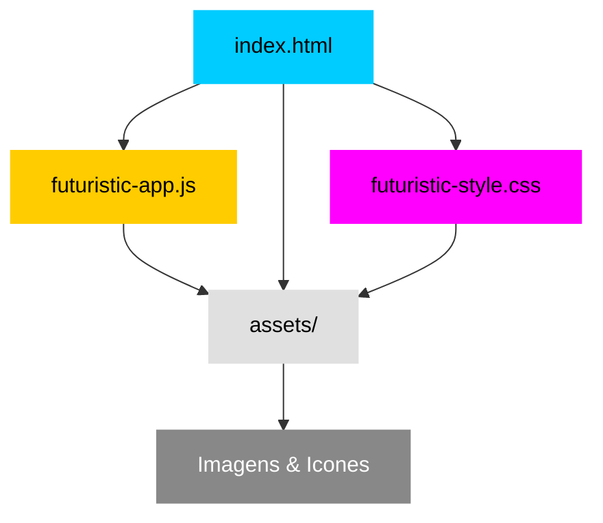

# 🌌✨ Sorteio Cósmico de Amigos ✨🌌

> Uma transmissão futurista para descobrir seu amigo secreto em uma edição Cyberpunk imersiva.


---

## 🧠 Visão Geral do Sistema

Esta é uma **aplicação web interativa** projetada para realizar sorteios de *Amigo Secreto* com uma estética **Cyberpunk** vibrante e imersiva. Através de uma interface futurista, você pode adicionar participantes, realizar sorteios de forma individual e revelar todos os pares, tudo acompanhado por **efeitos visuais e uma experiência temática completa**.

---

## 🚀 Funcionalidades da Transmissão

### ✅ Conexão de Participantes
* **Campo "Nome do Ser"**: Interface intuitiva para digitar os nomes.
* **Validação Inteligente**: Impede entradas vazias e nomes duplicados.
* **Remoção Dinâmica**: Permite remover participantes da lista antes do sorteio iniciar.

### 🎲 Simulação de Sorteio Cósmico
* **Sorteio Individual**: Seleção aleatória com animações neon em destaque.
* **Revelação Completa**: Botão "Revelar Todos os Pares" exibe a lista final (`Doador -> Recebedor`).
* **Reinício Seguro**: Modal de confirmação para resetar o sistema sem acidentes.

---

## 📊 Diagrama de Conexão do Projeto



---

## 🎨 Estética de Transmissão Cyberpunk

### 🎨 Paleta de Cores Neon
* **Fundo Escuro**: `#0a0a14` (Azul Profundo).
* **Ciano Elétrico**: `#00ccff` (Destaques e Títulos).
* **Magenta Vibrante**: `#ff00ff` (Botões de Ação).
* **Amarelo Ácido**: `#ffcc00` (Alertas e Reinício).

### 🅰️ Tipografia Futurista
* **Orbitron**: Para títulos e botões (Visual Tecnológico).
* **Rajdhani**: Para textos e labels (Legibilidade Moderna).

---

## 🛠️ Tecnologias de Conectividade

| Linguagem | Finalidade |
| :--- | :--- |
| **HTML5** | Estrutura semântica da interface. |
| **CSS3** | Estilização Cyberpunk e animações neon. |
| **JavaScript (ES6+)** | Lógica do sorteio e manipulação do DOM. |

---

## 🗂️ Estrutura de Arquivos

```text
.
├── assets/
│   ├── futuristic-friends-background.jpg   # Fundo temático
│   ├── play-game.png                       # Ícone Iniciar
│   ├── reload-game.png                     # Ícone Reiniciar
│   ├── close-icon.png                      # Ícone Remover
│   ├── waiting-data.gif                    # Animação de espera
│   └── arrow-right-futuristic.png          # Ícone de conexão
├── futuristic-app.js                       # Lógica JS
├── futuristic-style.css                    # Estilo CSS
└── index.html                              # Página Principal
```

---

## 📄 Licença

Este projeto está licenciado sob a **MIT License**.